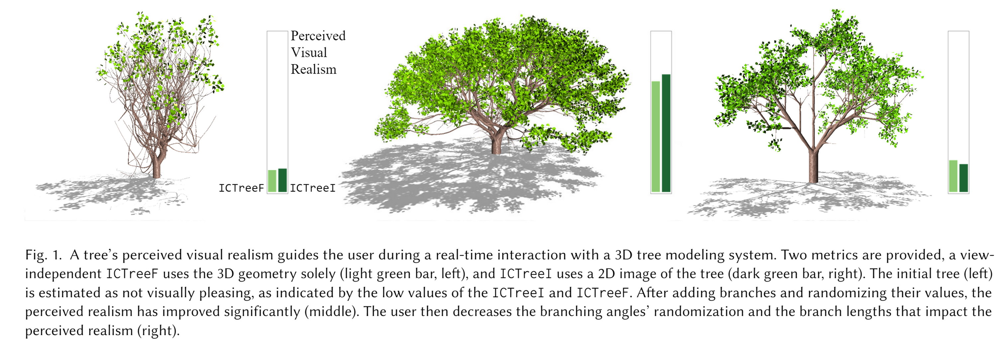

# ICTree: Automatic Perceptual Metrics for Tree Models



## What is this?

This is the main code repository for the paper *ICTree: Automatic 
Perceptual Metrics for Tree Models*. It concerns itself with the 
creation of automated metric for perceptual tree evaluation. 

#### Authors: 
 * Tomas Polasek ([ipolasek@fit.vutbr.cz](mailto:ipolasek@fit.vutbr.cz)), 
   Brno University of Technology, CPhoto@FIT
 * David Hrusa ([hrusadav@gmail.com](mailto:hrusadav@gmail.com)), 
   Purdue University
 * Bedrich Benes ([bbenes@purdue.edu](mailto:bbenes@purdue.edu)), 
   Purdue University; 
   Czech Technical University in Prague, FEL
 * Martin Cadik ([cadik@fit.vut.cz](mailto:cadik@fit.vut.cz)), 
   Brno University of Technology, CPhoto@FIT;
   Czech Technical University in Prague, FEL

#### Abstract: 
Many algorithms for synthetic tree generation exist, but the visual 
quality of the generated models is unknown. This problem is usually 
solved by performing limited user studies or by side-by-side comparison. 
We introduce an automated system for quality assessment of the tree 
model based on their perception. We conducted a user study in which 
over one million pairs of images were compared to collect subjective 
perceptual scores of generated trees. The perceptual score was used 
to train two neural-network-based predictors. A view independent ICTreeF 
uses the tree models geometric features that are easy to extract from 
any model. The second is ICTreeI that estimates the perceived visual 
quality of a tree from its image. Moreover, to provide an insight into 
the problem, we deduce intrinsic attributes and evaluate which features 
make trees look like real trees. In particular, we show that branching 
angles, length of branches, and widths are critical for perceived realism.

#### Content: 
 * **build/** : Project build output directory.
 * **Common/** : Common project libraries and resources.
 * **data/** : Additional data.
 * **PerceptualMetric/** : Python library covering the tree metrics.
 * **script/** : Helper scripts.
 * **TreeIO/** : C++ codebase containing the TreeIO utilities.
 * **TreeIOAcceleration/** : C++ library containing accelerated data structures.
 * **TreeIOLib/** : C++ library of common TreeIO data structures.

## How to Use?
The codebase consists of the native C++ module **PyTreeIO** and the Python 
Application **PercepTree**. This section covers how to get started and some 
basic use cases.

### Quick Start

This section covers a short tutorial on how to get both the **PyTreeIO** and 
**PercepTree** running. This includes the rendering component, which is by 
default configured for headless operation utilizing EGL.

Building of **PyTreeIO** is optional. However, if the module is not present, 
then the **Generate** subcommand of **PercepTree** will not be available.

##### Prerequisite Dependencies

The instructions assume that the following is available on the target device: 
 * **PercepTree**
   * Anaconda >= 2021.04
 * **PyTreeIO**
   * CMake >= 3.9
   * C++ compiler >= c++14 (GCC recommended)
   * Hardware support for OpenGL 4.3 Core profile
   * EGL support (headless) or display server (window)
   * C++ development libraries: 
     * Intel Thread Building Blocks (TBB)
     * Open Graphics Library (OpenGL, EGL, GLX)
     * OpenGL Extension Wrangler Library (GLEW)
     * OpenGL Utility Toolkit (GLUT)
     * Eigen (Eigen3)
     * PNG and JPEG (libpng, jpeg)

First, in case of building the **PyTreeIO**, ensure that all dependencies are 
installed and available. Next, we build the Python environment. We recommend 
using the Anaconda package for environment management, which can be used to 
create the **ictree** environment by using the following sequence of commands. 

Prepare the **ictree** environment: 
```
$ conda create -n ictree python=3.9
$ conda activate ictree
```

Install base dependencies: 
```
$ conda install -y \
    h5py matplotlib numpy pandas pillow progress \
    pytest python-dateutil ruamel.yaml seaborn \
    scipy scikit-learn setuptools sqlalchemy \
    swifter cython \
    -c anaconda -c conda-forge
```

Install PyTorch for CUDA 11.2: 
```
$ conda install -y \
    pytorch torchvision cudatoolkit=11.2 \
    -c pytorch -c conda-forge
```

##### Automated Package Installer

The most simple and straightforward procedure for building of the complete 
project, including both **PyTreeIO** and **PercepTree** is to use the included 
**setup.py** file. 

First clone the repository or extract the supplementary materials archive: 
```
Git: 
$ git clone https://github.com/PolasekT/ICTree ./ICTree && cd ./ICTree
Archive: 
$ unzip ICTree_Supplement.zip && cd ./ICTree_Supplement/ICTree
```

Activate the Anaconda environment: 
```
$ conda activate ictree
```

Build and install the **ICtree** Python package: 
```
$ (cd ./PerceptualMetric; python ./setup.py install)
```

Test the installation of the **PercepTree** module by running: 
```
$ python -m ictree.perceptree.perceptree_main
```

In order to verify that the **PyTreeIO** is available, check the output of: 
```
$ python -m ictree.perceptree.perceptree_main 2>&1 | grep "PyTreeIO"
```

##### Manual Build

The environment also allows a manual build, without package installation. This 
includes both **PyTreeIO** and **PercepTree** modules, permitting additional 
configuration options.

First clone the repository or extract the supplementary materials archive: 
```
Git: 
$ git clone https://github.com/PolasekT/ICTree ./ICTree && cd ./ICTree
Archive: 
$ unzip ICTree_Supplement.zip -d ./ICTree_Supplement && cd ./ICTree_Supplement/ICTree
```

Activate the Anaconda environment: 
```
$ conda activate ictree
```

Optionally build the **PyTreeIO** module choosing the desired rendering backend: 
 * **EGL** : Headless rendering, requires EGL support.
 * **GLU** : Windowed rendering, requires display server.
```
$ python scripts/build_modules.py --render-backend EGL
```

Test the installation of the **PercepTree** module by running: 
```
$ ( 
    export PYTHONPATH="PerceptualMetric/psrc:$PYTHONPATH"; 
    python PerceptualMetric/psrc/perceptree/perceptree_main.py
  )
```

Verify whether the **PyTreeIO** is available, check the output of: 
```
$ (
    export PYTHONPATH="PerceptualMetric/psrc:$PYTHONPATH"; 
    python PerceptualMetric/psrc/perceptree/perceptree_main.py 2>&1 | grep "PyTreeIO"
  )
```

### Running PercepTree

After following the instructions in the [Quick Start](#quick-start) section, 
the **PercepTree** helper script **perceptree_main.py** should be available. 
Depending on which path was used - [automated](#automated-package-installer) 
or [manual](#manual-build) - the commands to execute this script are: 
```
Automated: 
$ python -m ictree.perceptree.perceptree_main
Manual: 
$ PYTHONPATH="<ICTree>/PercepTree/psrc:$PYTHONPATH" python \
    <ICTree>/PerceptualMetric/psrc/perceptree/perceptree_main.py
```
The following sections will assume that either of these options was aliased 
as **perceptree_main.py**.

### Data Generation

The **Generate** sub-module allows generation of training and other derived 
data from raw **.tree** or **.fbx** files. Supported operations include: 
 * **Featurization** : Generation of feature vectors for the **ICTreeF**.
 * **Rendering** : Generation of image data for the **ICTreeI**.
 * **Augmentation** : Augmentation of skeleton node and branch data.
 * **Dithering** : Augmentation of view camera positions.

For a simple example of preparing all supported tree files from the input 
directory **input/** and storing the results to **output/**, use: 
```
$ perceptree_main.py Generate --input-path input/ --output-path output/ \
    --do-feature --do-render --do-augment --do-dither
```

### Data Utilization

The **Data** sub-module allows several means of supplying data both to the 
model training and prediction operations. The most straightforward way to 
supply the training data is to provide a pre-exported dataset containing 
both the trees and rendered views. Several such datasets are available, both 
as a part of the provided supplementary materials as well as on the project 
[website](http://cphoto.fit.vutbr.cz/ictree). 

A dataset situated in its **\<DS_ROOT\>** directory contain the following: 
 * **dataset_meta.json** : Metadata concerning the dataset version.
 * **results.csv** : List of results from the MTurk user study.
 * **users.csv** : List of users from the MTurk user study.
 * **scores.csv** : Optimized JOD scores for all trees and views.
 * **scores_indexed.csv** : Optimized JOD scores indexed by tree and view.
 * **spherical_scores_indexed.csv** : Interpolated scores for view variants.
 * **tree_catalogue.csv** : Catalogue of all available tree files.
 * **view_catalogue.csv** : Catalogue of all available views and modalities.
 * **tree\<ID\>/** : Folders containing the tree data
   * **tree\<ID\>.tree** : Base tree skeleton data using the TreeIO format.
   * **skeleton** : Augmented skeletons (**.tree**) and metadata (**.json**).
   * **branch** : Augmented skeleton variants (**.tree**) and metadata (**.json**).
   * **views** : Base views (**.png**) along with metadata (**.json**).
   * **dither** : Augmented views (**.png**) along with metadata (**.json**).

Dataset in the above format may then be utilized by specifying: 
```
$ perceptree_main.py Data --dataset-path <DS_ROOT> ...
```
which accepts the following options: 
 * **--dataset-use-dithered True|False** : Enabling/disabling the augmented views.
 * **--dataset-use-augment True|False** : Enabling/disabling the augmented skeletons.

### Model Training

Both **ICTreeF** and **ICTreeI** are based on neural network predictors, which must 
be trained before use. Pre-trained variants are available for download on the project 
[website](http://cphoto.fit.vutbr.cz/ictree) or in the supplementary materials. In 
order to train a fresh prediction model a [dataset](#data-utilization) is required. 

To run the training routine for the default **ICTreeF** model, execute: 
```
$ perceptree_main.py \
    Data \
    --dataset-path <DS_ROOT> --dataset-use-dither True --dataset-use-augment True \
    FeaturePredictor \
    --train --save ictreef.tpm --feature-standardize True \
    --use-view-scores True --use-tree-variants True --use-view-variants True \
    --pre-generate-variants False --binary-pretraining True \
    --differential-pretraining True --model-type dnn \
    --feature-buckets 8 --feature-resolution 32
```

To train the default **ICTreeI** model, execute: 
```
$ perceptree_main.py \
    Data \
    --dataset-path <DS_ROOT> --dataset-use-dither True --dataset-use-augment True \
    ImagePredictor \
    --train --save ictreei.tpm --view-resolution 256 \
    --use-view-scores True --use-tree-variants True --use-view-variants True \
    --pre-generate-variants False --binary-pretraining True \
    --differential-pretraining True --network-style res2net50_v1b \
    --network-pretrained True
```

### Score Prediction

After acquiring the requisite **ICTreeF** and **ICTreeI** models, the tree scores 
can be predicted using the **Predict** sub-module in several ways. 

For example, to predict scores for all trees within the current dataset, using our 
pre-trained model **ictreef.tpm** and save the results to **eval.csv**, execute: 
```
$ perceptree_main.py \
    Data --dataset-path <DS_ROOT> \
    FeaturePredictor --load ictreef.tpm \
    Predict --predict-tree id:-1,view:-1;0:base \
    Evaluate --evaluate-current --export-evaluations eval.csv
```

To perform view score predictions using the **ictreei.tpm**, execute: 
```
$ perceptree_main.py \
    Data --dataset-path <DS_ROOT> \
    ImagePredictor --load ictreei.tpm \
    Predict --predict-views id:-1,view:-1;0:base \
    Evaluate --evaluate-current --export-evaluations eval.csv
```

Similarly, predictions for trees and images outside of the dataset are also possible. 
For example, score predictions for all trees and views in the **input** folder may be 
gained by running: 
```
$ perceptree_main.py \
    FeaturePredictor --load ictreef.tpm \
    ImagePredictor --load ictreei.tpm \
    Predict --predict-tree-folder input/ --predict-views-folder input/ \
    Evaluate --evaluate-current --export-evaluations eval.csv
```

### Result Evaluation

Finally, following the score prediction, additional evaluation may be performed on 
the results to judge the efficacy of the models. Evaluations are executed by the 
**Evaluate** sub-module. Its basic use for evaluation of current score predictions 
may also be seen in the previous [section](#score-prediction). 

Evaluations can be exported by using the **--export-evaluations** to specify the 
output file. The evaluation module also allows exporting of annotated images with 
score bars, which may be achieved by specifying **--export-images** along with 
a path to export the images to.

### Advanced Uses

For additional uses, please see the integrated help menu (**--help**) and the 
supplementary materials pdf.

## License
The code contained within this repository is licensed under the MIT license. For 
licensing information concerning the TreeIO dataset and additional supplementary 
data, please see the project website at 
[cphoto.fit.vutbr.cz/ictree](http://cphoto.fit.vutbr.cz/ictree)
```
MIT License

Copyright (c) 2021 Tomas Polasek, David Hrusa, Bedrich Benes, Martin Cadik

Permission is hereby granted, free of charge, to any person obtaining a copy
of this software and associated documentation files (the "Software"), to deal
in the Software without restriction, including without limitation the rights
to use, copy, modify, merge, publish, distribute, sublicense, and/or sell
copies of the Software, and to permit persons to whom the Software is
furnished to do so, subject to the following conditions:

The above copyright notice and this permission notice shall be included in 
all copies or substantial portions of the Software.

THE SOFTWARE IS PROVIDED "AS IS", WITHOUT WARRANTY OF ANY KIND, EXPRESS OR
IMPLIED, INCLUDING BUT NOT LIMITED TO THE WARRANTIES OF MERCHANTABILITY,
FITNESS FOR A PARTICULAR PURPOSE AND NONINFRINGEMENT. IN NO EVENT SHALL THE
AUTHORS OR COPYRIGHT HOLDERS BE LIABLE FOR ANY CLAIM, DAMAGES OR OTHER
LIABILITY, WHETHER IN AN ACTION OF CONTRACT, TORT OR OTHERWISE, ARISING FROM,
OUT OF OR IN CONNECTION WITH THE SOFTWARE OR THE USE OR OTHER DEALINGS IN THE
SOFTWARE.
```
